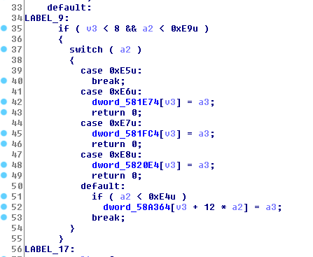
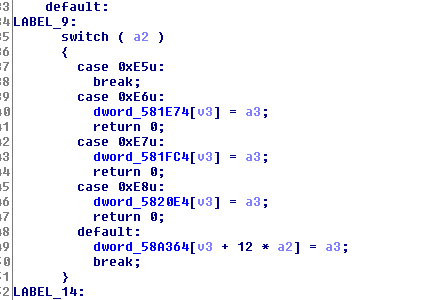
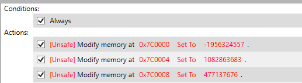
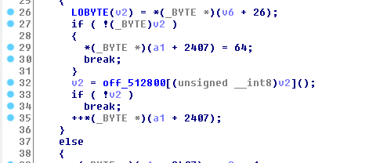
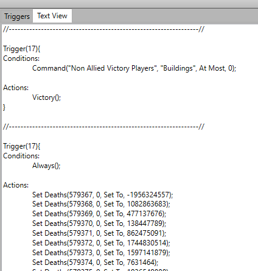

# Midnight Sun CTF - StarCraft (363 pts, 7 solves)
*Writeup Author: hpmv*.

This is a writeup of the StarCraft challenge; we played as part of the team An Equal Mix in this CTF, ranking 3rd overall.

## Initial Analysis

We're given a bspatch to the StarCraft 1.6.1 binary which apparently makes it vulnerable. Our objective is to pwn the opponent in a multiplayer game to read the contents of flag.txt on their desktop.

The patch is very small. Looking at the effects of the patch in IDA, we see differences in three functions, at `0xc5a80`, `0xc5c60`, and `0xc5dd0`. The changes are pretty similar for all three functions; here is one of them (`0xc5dd0`):

Left is original; right is the patched version. We see that the checks on `v3` and `a2` were removed. It seems reasonable to assume that the check was removed to enable a buffer overflow bug on one of the static storage addresses.

A quick session with WinDbg and breakpointing at these addresses as well as inspecting the memory regions (such as `0x58a364`) turned up nothing particularly interesting. It wasn't clear what kind of game logic this is even related to. My initial guess was that `v3` and `a2` came from network messages, and if that were the case then debugging locally with single player would not trigger this code. If I were to try and reverse engineer the surrounding calls, that would have been such a daunting task with a large binary like this, and I didn't think I was expected to do something of that scale in a 24h CTF (or rather, I did't think the challenge author would have reverse engineered a whole StarCraft binary just to make a challenge for this CTF, either.)

So I thought I would just Google the address `0x58a364`. Surprisingly that came up with some very relevant results!

## About StarCraft EUD Maps

Apparently this was existing research done by people who made StarCraft maps (or maybe others, I'm not sure). `0x58a364` is the address for the "unit death table" which, to my understanding, is a 2D array where `table[i][j]` stores the number of unit of type `j` that player `i` has killed (or maybe the number of such unit that died; doesn't really matter).

It turns out that custom StarCraft maps allows authors to add *triggers*. Each trigger applies to one or all players, under certain conditions (such as "always" or "when a unit is killed"), and applies certain actions (such as "show a message to the player" or "spawn a unit of a certain type", or "set the death count for some unit to some number"). These triggers allow map makers to program an interesting scenario for players.

The "set death count" action is actually the code we're looking at in the above screenshots (specifically the statement `dword_58a364[v3 + 12 * a2] = a3`). The StarCraft community was especially interested in this action because it allows buffer overflows when the trigger encodes an out-of-bound value for the unit type. In fact, someone even made [a trigger editor](http://www.staredit.net/topic/17518/) which allows authors to easily create a trigger that modifies any specific memory address to any value!

## Performing Arbitrary Write

With this trigger editor, I created a map which has an unconditional trigger that writes memory, like this:

All it takes to trigger this condition is to open this map. One thing to watch out for is that you must select "Use Map Settings" when loading the map; otherwise, none of the triggers will apply.

This gives us arbitrary write. How do we actually go from here to reading a file on the desktop?

## Gaining Program Control

One idea is to look for a way to control `eip`, and then either ROP or something else like that. In WinDbg, I realized that there are RWX sections, such as one at `0x7c0000` (there is no apparent ASLR), so once I control `eip` I could just make it jump to shellcode (which I would write first using triggers).

I walked out of the patched function to see who calls it, and going up a couple of steps I see an indirect function call (in function `0x489130`):

Well this makes it easy! We can just overwrite the address at `0x512868` and then the indirect call that used to land at the death count handling code would call our shellcode instead!

(I'm guessing that the reason there's a table of function pointers at `0x512800`) is that this is a table of action handlers that the trigger processing code walks through, to handle different types of triggers.)

## Windows Exploitation

Okay, at this point all I needed to do is find a shellcode that works. The problem is, I had literally zero Windows exploitation experience (never pwned any Windows binary even for practicing) and nobody on my team was experienced at it either. So I just looked for off-the-shelf Windows shellcodes.

This is extra difficult because we are doing remote exploitation (we don't have a socket to make a reverse shell through), and without the username we can't exactly use a "sendfile" shellcode (i.e. something that reads a file and sends it somewhere). There are 2 ways I thought of, one was to spawn a reverse shell, and the other is to invoke `cmd` with some fancy command that finds the flag file and uploads it somewhere. The problem is I don't have any idea how to do either.

Another complication is that some Windows shellcode apparently only works on certain Windows versions, and we don't know what version the server is running.

With all this in mind, I found [a shellcode](http://shell-storm.org/shellcode/files/shellcode-389.php) that makes a reverse shell by TCP and is apparently generic (independent of the Windows version). This shellcode does some export table magic to find the symbol LoadLibraryA, loads the msvcrt (Microsoft C Runtime) and then calls `system` from the C library (wow, smart!). Right before doing that, it opens a socket (using `connect`) and sets the stdin, stdout, and stderr to this socket.

I compiled this shellcode into an executable (after changing the IP and port of course) using MASM, and ran it (using WinDbg to debug any issues); it worked! I was able to get a reverse shell.

However, when I put this shellcode into StarCraft's memory (with the arbitrary overwrite described above, and see below for how exactly that is encoded into the map), the shellcode ran successfully but I did not get a reverse shell! Instead, a `cmd` window popped up, my socket was connected, but the stdin/stdout were not redirected. Hmm...

It turns out that in Windows, there is a big difference between a "Console Application" vs a "Windows Application". The former is similar to a linux application but the latter does not even have stdin/stdout/stderr! A Windows Application is quite special (such as its main function is `WinMain` instead of `main`) and is very different. When executing the `system` function, if the current application is a console application, it will reuse the same console, but if the current application is a Windows application, a new console window will pop up to host it.

The shellcode, before it runs `system`, redirects stdin/stdout/stderr to the socket; that does not work because StarCraft is a Windows Application which does not have stdin/stdout/stderr! As a result the `system` call spawns a new console window without any redirects. When I compiled the shellcode by itself, it worked because I was compiling it as a console application. When I tried compiling it as a Windows application, it had the same behavior as running in StarCraft.

## Windows Exploitation, Attempt 2

Again, I had little knowledge of how Windows shellcode works so I didn't attempt to fix the code (such as by calling CreateProcessA that allows us to specify where stdin/stdout/stderr go). Instead, I looked for a better shellcode.

I ran into this [other shellcode](http://shell-storm.org/shellcode/files/shellcode-157.php) which downloads another executable via TCP and then executes that executable. I had to tweak this shellcode a bit, mostly to change the path of the executable to an absolute path so I could debug it properly with WinDbg, but otherwise it works very well. One concern I had was whether the CTF server would allow me access to write a file, but judging from how loose Windows filesystem permissions are and also the fact that the game has to be run as admin on modern Windows systems, I was confident enough that I would have file write access, and indeed I had.

With this shellcode, I send in the other shellcode as an executable, and that gets executed in turn, making the whole exploit work.

The final hurdle was on getting the CTF bot to join my lobby. There were two issues, one was that I had to open some firewall ports; the other was that I did not choose the expansion when picking the game type :)

## Getting the Shellcode into the Map

Since Windows shellcode is long, manually entering triggers would be very cumbersome. Luckily, the same trigger editor I used had a functionality to specify triggers via code:

So I wrote a quick Python script to generate these commands. Each trigger has an action limit somewhere around ~50, so I just break them up into multiple triggers. The most important thing is that the final function pointer swap must happen last.

## Parting Words

This was a very fun challenge! Thanks to ZetaTwo for authoring it; I imagine the amount of effort spent in getting everything to work must be substantial.

On the topic of Windows exploitation I probably used a pretty clumsy way to do it. I'm curious what others have done - and I should go learn more about it in general :)